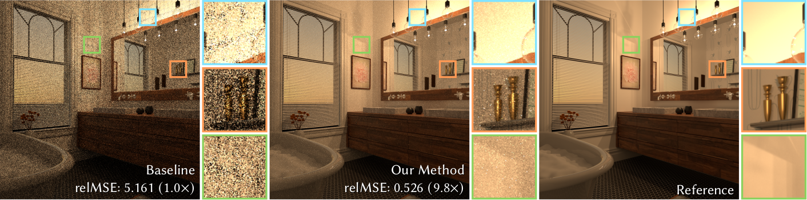

Robust Fitting of Parallax-Aware Mixtures for Path Guiding
==========================================================

This repository contains the author's implementation of ["Robust Fitting of Parallax-Aware Mixtures for Path Guiding"](https://uni-tuebingen.de/fakultaeten/mathematisch-naturwissenschaftliche-fakultaet/fachbereiche/informatik/lehrstuehle/computergrafik/lehrstuhl/veroeffentlichungen/publications-since-2012/robust-fitting-of-parallax-aware-mixtures-for-path-guiding/).
It is implemented as a plugin for the [Mitsuba renderer](http://mitsuba-renderer.org/).
If you have any questions, do not hesitate to ask Lukas Ruppert [lukas.ruppert@uni-tuebingen.de](mailto:lukas.ruppert@uni-tuebingen.de) and/or Sebastian Herholz [sebastian.herholz@gmail.com](mailto:sebastian.herholz@gmail.com).

## IMPORTANT: Recent spectral interpolation fix in Mitsuba
We merged commit `cfeb7766e7a1513492451f35dc65b86409655a7b` from the [official Mitsuba repository](https://github.com/mitsuba-renderer/mitsuba) which fixes the interpolation of spectral color values.
This will change the appearance of scenes defined using spectral colors.
When comparing against this code please apply the patch to your code base and update your reference images!

## Cloning the repository
Make sure to clone the repository with the `--recurse-submodules` option, to also clone the vectorclass submodule.
If you forgot the `--recurse-submodules` flag, you can use `git submodule update --init --recursive` to clone the submodule afterwards.

## Compiling Mitsuba
For compilation, have a look at the [Mitsuba documentation](http://mitsuba-renderer.org/docs.html).
We did not add any new dependencies.
If you're running Ubuntu, you can install the required prerequisites using `install_prerequesites_ubuntu.sh`.

With the prerequisites installed, the code can be compiled on Linux using SCons: (append `-jX` for parallel compilation, e.g. `-j8`)

    scons --cfg=build/config-linux-gcc.py

We have merged and extended the patch for Python 3 compatibility, so that recent versions of SCons should work as well.
Let us know if any changes to the configuration files are necessary for other operating systems.

We have so far tested compilation on Ubuntu 18.04, 20.04, and openSUSE Tumbleweed.

### Compiling the GUI
For compiling the GUI, check the configuration for Qt5 in `data/scons/qt5.py`.
We have modified it for our systems, where all Qt packages start with a *Qt5* prefix rather than just *Qt*.
To simplify compilation on modern systems, we have also replaced GLEW-mx with GLEW.

## Running Mitsuba
To run Mitsuba, you can either use the GUI `mtsgui` or the command-line version `mitsuba` you find in the `dist` folder after the compilation has finished.
For both of them, you need to add the `dist` folder to the `LD_LIBRARY_PATH` before running them or they will not be able to load their plugins.
The simplest way to do this is using the `setpath.sh` script:

    source setpath.sh
    ./dist/mtsgui

## Reproducing the results
To reproduce the paper's main results shown in Figure 8 and Table 3, you can simply run the provided script `reproduce_results.sh`.
On a fresh installation of Ubuntu 20.04, you can first run `install_prerequesites_ubuntu.sh` and then `compile.sh` to compile Mitsuba.
Other operating systems should work as well, but you will have to install the necessary dependencies yourself.

Reproducing the results on similar Hardware should take about 4-5 Hours.
Each of the reproduced experiments was originally run for 10 minutes and are now configured for a set amount of samples for hardware-independent reproduction.
On a 8-Core desktop CPU you're looking at about 12 Hours total.

Note that we cleaned up the code and made some small optimizations.
The code should now run slightly faster than the reported numbers when run on the same hardware.
Our reference hardware is using dual Intel(R) Xeon(R) Gold 5115 CPUs @ 2.40GHz (40 threads).

The resulting images will be stored in each scene's folder,
result tables will be created as `table3.csv` and `figure8.csv`.
Speedup can be computed as relMSE of the baseline / relMSE of the result.
For Table 3, the baseline is [Practical Path Guiding](https://github.com/Tom94/practical-path-guiding), configured as follows:

| option                   | setting    |
|--------------------------|------------|
| nee                      | never      |
| sppPerPass               | 4          |
| spatialFilter            | stochastic |
| directionalFilter        | box        |
| sTreeThreshold           | 4000       |
| sampleCombination        | automatic  |
| bsdfSamplingFractionLoss | none       |

For Figure 8 it is the simplest guiding method *Li*.

## Using the guided path tracer
You can simply select the "Path Guiding" integrator from the mitsuba GUI
and set a few parameters that suit your use-case.

You can find a selection of scenes with provided example configurations linked on the [project page](https://uni-tuebingen.de/fakultaeten/mathematisch-naturwissenschaftliche-fakultaet/fachbereiche/informatik/lehrstuehle/computergrafik/lehrstuhl/veroeffentlichungen/publications-since-2012/robust-fitting-of-parallax-aware-mixtures-for-path-guiding/).
You can find more scenes at the [Mitsuba website](http://mitsuba-renderer.org/download.html), as well as Benedikt Bitterli's [Rendering Resources](https://benedikt-bitterli.me/resources/).

### Rendering for a fixed set of training/rendering samples
To train and render for a fixed number of samples,
you need to set the option *training samples* to the desired amount and you need to set *training time* to 0.
For setting the samples for rendering, simply set the according value of the used sampler.

When choosing the amount of samples for training, it generally works well to use an equal amount of samples for training and rendering,
while often even fewer training samples suffice, especially when using more than 512spp for rendering.
You may need to experiment a bit to get the maximum performance as the optimal amount will depend on the scene.
You can easily keep track of the training progress in the live preview and choose a suitable number based on your observations.

### Rendering for a fixed amount of training/rendering time
If you want to train and render for a fixed amount of time, you need to explicitly set the *training samples* to 0.
Then, simply set *training time* and *render time*.
Additionally, you need to set the samples per pixel in the sampler to 4 or less,
as the image will be rendered repeatedly using exactly that sampler configuration.
Also be aware, that the code tries to estimate the duration of the following rendering iteration and will terminate early if it decides that the following iteration will exceed the time budget.
We do this to play fair in equal-time comparisons.
To do your part for a fair comparison, please choose a lower amount of samples per pixel if the iterations take too long and the code terminates too early as a result of that.

### Controlling the number of samples per pixel per training iteration
The number of samples per training iteration can be controlled by the parameter *samples per iteration*.
You will find that even at 1 sample per pixel, the light transport in a scene can be learned reliably and in some cases even faster.
Via a hidden option (see below) you can enable exponential training, which doubles the number of samples each iteration.

Torus scene trained with 16spp using 1spp per iteration, rendered with 32spp.
On a 8-Core desktop CPU, this takes less than 30 seconds.

### Caveats
#### Floating-point parsing in the GUI
When entering floating-point values in the GUI, generally be aware of your locale (e.g., decimal point vs. decimal comma).
While numbers are displayed with a decimal point, they are parsed based on your local format.
So, when entering floats, click on another property and verify that the number you have entered has been parsed properly.

#### Russian Roulette
Whenever you use the guided path tracer, it is advisable to disable Russian roulette,
as the guided path tracer often generates low-throughput paths which would be terminated too early.

### Even more parameters
For more details on the parameters, look at the documentation in the GUI or at the code itself.
There are a few more parameters which are hidden by default to keep the GUI simple.
They control options regarding importing and exporting of guiding data and intermediate states
as well as some options which can be used for visualization and debugging of some internal information.
There is also an implementation of ADRR (no splitting), but please do not use it when comparing with our method.
Finally, options for training in an *exponential* fashion or without incremental updates are available.
They are intended to simulate the behavior of previous methods and not very practical otherwise.
To enable them in the GUI, simply remove the comment markers in `src/mtsgui/resources/docs.xml`.

## Implementation
The guided path tracer is implemented under `src/integrators/pathguiding/pathguiding.cpp` and makes heavy use of the code within `include/mitsuba/guiding`.
Even though the code currently only supports mixtures using the von Mises-Fisher distribution, it is heavily templated to allow for arbitrary combinations of directional distributions and additional statistics.

### Python API
A Python API for inspection of exported guiding distributions and sample data is implemented in `src/libpython/guiding.cpp`.
Note that the Python API is only compiled if the necessary Boost-Python and Python development packages are installed on your system.
Check the Mitsuba documentation for details.

### Modifications to Mitsuba
Although we have tried to keep the modifications to Mitsuba at a minimum, many core files have been modified and extended slightly.
You will find these modifications as separate commits in a separate branch. Some of them fixed existing bugs or updated deprecated code to support newer compilers.
Most third-party plugins and extensions should still be compatible.

## License
The code is licensed under GNU GPLv3, see LICENSE for details.
